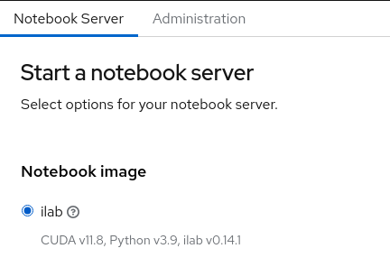

### Build an ilab image

Create an ilab notebook image for CUDA. Check out the other GPU type Containerfiles:

- https://github.com/instructlab/instructlab/tree/main/containers

Start the build in OpenShift.

```bash
oc -n openshift new-build \
  --strategy docker --dockerfile - --name ilab < instructlab/Dockerfile
```

To build a particular version.

```bash
oc -n openshift new-build \
  --strategy docker --dockerfile - --name ilab --build-arg ILAB_VERSION=0.16.1 --to ilab:0.16.1 < instructlab/Dockerfile
```

Import the image stream into RHOAI so it appears as a notebook image called `ilab`.

```bash
imageref=$(oc -n openshift get istag ilab:latest -o jsonpath='{.image.dockerImageReference}')

cat <<EOF | oc apply -f -
apiVersion: image.openshift.io/v1
kind: ImageStream
metadata:
  name: ilab
  namespace: redhat-ods-applications
  annotations:
    opendatahub.io/notebook-image-desc: "Ilab Notebook Image build with GPU Support"
    opendatahub.io/notebook-image-name: ilab
    opendatahub.io/notebook-image-order: "10"
    opendatahub.io/recommended-accelerators: '["nvidia.com/gpu"]'
  labels:
    app.kubernetes.io/part-of: workbenches
    app.opendatahub.io/workbenches: "true"
    component.opendatahub.io/name: notebooks
    opendatahub.io/component: "true"
    opendatahub.io/notebook-image: "true"
spec:
  lookupPolicy:
    local: false
  tags:
  - annotations:
      opendatahub.io/notebook-python-dependencies: '[{"name":"JupyterLab","version":"3.6"},{"name":"Notebook","version":"6.5"}]'
      opendatahub.io/notebook-software: '[{"name":"CUDA","version":"12.1"},{"name":"Python","version":"v3.9"},{"name":"ilab","version":"v0.14.1"}]'
      opendatahub.io/workbench-image-recommended: "true"
      openshift.io/imported-from: quay.io/modh/cuda-notebooks
    from:
      kind: ImageStreamImage
      name: "$(echo -n ${imageref##image-registry.openshift-image-registry.svc:5000/openshift/})"
      namespace: openshift
    importPolicy:
      importMode: Legacy
    name: latest
    referencePolicy:
      type: Source
EOF
```

